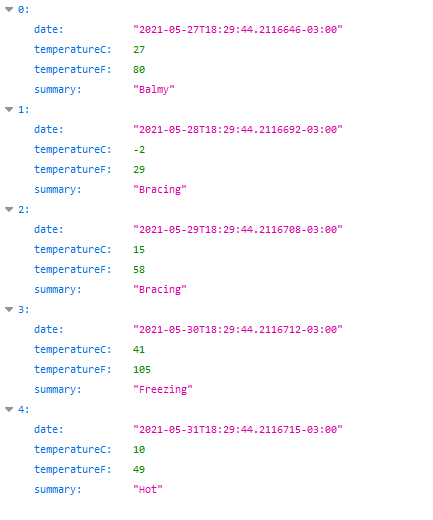
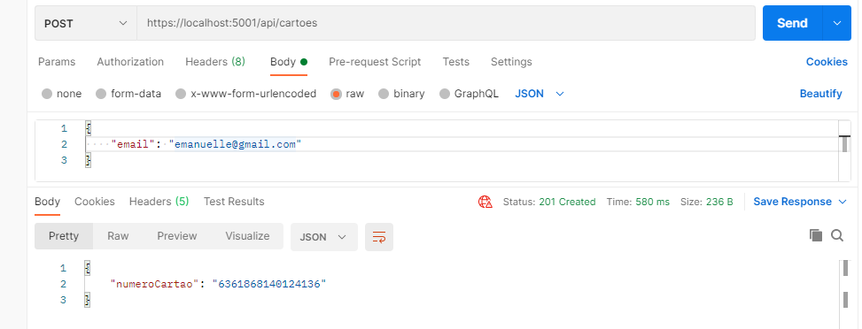
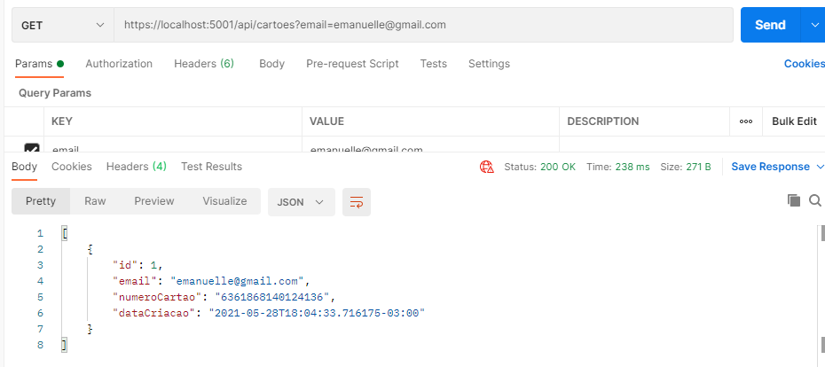

# **Como criar uma API REST com .NET 5 e Entity Framework Core**


#### Neste post falaremos sobre a criação de uma API REST para um sistema de geração de número de cartão de crédito virtual utilizando C# e .NET 5 e o *Entity Framework*. A API terá dois métodos: um de cadastro de cartão e o outro de listagem deste.

Assim, teremos dois endpoints, representados abaixo:

| Endpoint   |     Descrição     | Corpo da requisição  | Resposta |
|----------|:-------------:|------:|------:|
| ```POST /api/cartoes  ```|  gera um cartão virtual| { “email”: “seuemail@email.com”}| { “cartao”: “4716402666880187”} |
| ``` GET /api/cartoes?email={email}  ``` |    exibe lista de cartões de acordo com o email informado  | |  [{ “cartao”: “4716402666880187”, dataCriacao: “09/05/2021”},  { “cartao”: “4716402666880187”, dataCriacao: “09/05/2021”}] |


## **Pré-requisitos**:
- [IDE Visual Studio Code](https://code.visualstudio.com/);
- [Versão mais recente do C#](https://marketplace.visualstudio.com/items?itemName=ms-dotnettools.csharp);
- [.NET versão 5,0 ou superior](https://dotnet.microsoft.com/download/dotnet/5.0);

## **Criando um novo projeto de API**:


Após a instalação das ferramentas citadas acima, criaremos o projeto utilizando o comando abaixo:

```
dotnet new webapi -o vaivoa-api-cartoes
```
Depois digite o comando abaixo para localizar o projeto criado:

```
cd vaivoa-api-cartoes
```
Será necessário adicionar o pacote do *Entity Framework Core In Memory* que é basicamente um provedor de banco de dados que possibilita que o Entity seja usado como um banco de dados em memória. Para isso, use o código conforme abaixo:

```
dotnet add package Microsoft.EntityFrameworkCore.InMemory
```

Logo após, basta digitar o comando ```code .``` para abrir o projeto no Visual Studio Code:

```
	code .
```
Obs: vai aparecer uma mensagem perguntando se você deseja adicionar tudo o que é necessário para que o projeto funcione, neste caso você vai selecionar a opção “sim”.

Execute o comando abaixo para iniciar seu projeto:

```
dotnet run
```

Depois disto, copie e cole a URL de solicitação https://localhost:5001/WeatherForecast em seu navegador para verificar se está retornando o JSON abaixo:



Caso sim, então o projeto base para a API já está funcionando.

## **Criando uma classe de modelo**:

 Por convenção, para definir uma entidade, é utilizado uma pasta chamada *Models* e dentro dela, adicionamos a classe ```Cartao.cs``` com o código abaixo:

```csharp
using System;

namespace VaiVoaApiCartoes.Models
{
    public class Cartao
    {
        public long Id { get; set; }
        public string Email { get; set; }
        public string NumeroCartao { get; set; }

        public DateTime DataCriacao { get; set; }
    }
}
```
### **Adicionando um contexto de banco de dados**:

O contexto de banco de dados é a principal classe que direciona a funcionalidade do *Entity Framework* para um modelo de contexto de dados e essa classe é criada a partir da seguinte classe: *Microsoft.EntityFrameworkCore.DbContext.*

Para isto, é preciso criar um arquivo *CartaoContext.cs* dentro da pasta *Model* e inserir o código abaixo:

```csharp

using Microsoft.EntityFrameworkCore;

namespace VaiVoaApiCartoes.Models
{
    public class CartaoContext : DbContext
    {
        public CartaoContext(DbContextOptions<CartaoContext> options)
               : base(options)
        {
        }

        public DbSet<Cartao> Cartoes { get; set; }
    }
}

```
Atualize o arquivo *Startup.cs* inserindo o código destacado abaixo:


```diff
// Unused usings removed
using Microsoft.AspNetCore.Builder;
using Microsoft.AspNetCore.Hosting;
using Microsoft.Extensions.Configuration;
using Microsoft.Extensions.DependencyInjection;
using Microsoft.Extensions.Hosting;
+using Microsoft.EntityFrameworkCore;
+using Cartao.Models;

namespace VaiVoaApiCartoes
{
    public class Startup
    {
        public Startup(IConfiguration configuration)
        {
            Configuration = configuration;
        }

        public IConfiguration Configuration { get; }

        public void ConfigureServices(IServiceCollection services)
        {
+            services.AddDbContext<TodoContext>(opt =>
+                                              opt.UseInMemoryDatabase("Cartoes"));
            services.AddControllers();
        }

        public void Configure(IApplicationBuilder app, IWebHostEnvironment env)
        {
            if (env.IsDevelopment())
            {
                app.UseDeveloperExceptionPage();
            }

            app.UseHttpsRedirection();
            app.UseRouting();

            app.UseAuthorization();

            app.UseEndpoints(endpoints =>
            {
                endpoints.MapControllers();
            });
        }
    }
}
```
Depois, será  preciso ajustar o controlador instalando os seguintes pacotes do *Entity Framework*:

```csharp
dotnet add package Microsoft.VisualStudio.Web.CodeGeneration.Design
dotnet add package Microsoft.EntityFrameworkCore.Design
dotnet add package Microsoft.EntityFrameworkCore.SqlServer
dotnet tool install -g dotnet-aspnet-codegenerator
```
Após, para fazer o scaffold do controlador, execute o seguinte comando :

```csharp
dotnet aspnet-codegenerator controller -name CartaoController -async -api -m Cartao -dc CartaoContext -outDir Controllers
```
O comando executado acima gerou a classe CartaoController.cs dentro da pasta Controllers com os métodos de criar, ler, atualizar e deletar registros referentes ao Cartao. Esse atributo serve para indicar se o controlador responde às solicitações da API.

```csharp
using System;
using System.Collections.Generic;
using System.Linq;
using System.Threading.Tasks;
using Microsoft.AspNetCore.Http;
using Microsoft.AspNetCore.Mvc;
using Microsoft.EntityFrameworkCore;
using VaiVoaApiCartoes.Models;

namespace VaiVoaApiCartoes.Controllers
{
    [Route("api/[controller]")]
    [ApiController]
    public class CartaoController : ControllerBase
    {
        private readonly CartaoContext _context;

        public CartaoController(CartaoContext context)
        {
            _context = context;
        }

        // GET: api/Cartao
        [HttpGet]
        public async Task<ActionResult<IEnumerable<Cartao>>> GetCartoes()
        {
            return await _context.Cartoes.ToListAsync();
        }

        // GET: api/Cartao/5
        [HttpGet("{id}")]
        public async Task<ActionResult<Cartao>> GetCartao(long id)
        {
            var cartao = await _context.Cartoes.FindAsync(id);

            if (cartao == null)
            {
                return NotFound();
            }

            return cartao;
        }

        // PUT: api/Cartao/5
        // To protect from overposting attacks, see https://go.microsoft.com/fwlink/?linkid=2123754
        [HttpPut("{id}")]
        public async Task<IActionResult> PutCartao(long id, Cartao cartao)
        {
            if (id != cartao.Id)
            {
                return BadRequest();
            }

            _context.Entry(cartao).State = EntityState.Modified;

            try
            {
                await _context.SaveChangesAsync();
            }
            catch (DbUpdateConcurrencyException)
            {
                if (!CartaoExists(id))
                {
                    return NotFound();
                }
                else
                {
                    throw;
                }
            }

            return NoContent();
        }

        // POST: api/Cartao
        // To protect from overposting attacks, see https://go.microsoft.com/fwlink/?linkid=2123754
        [HttpPost]
        public async Task<ActionResult<Cartao>> PostCartao(Cartao cartao)
        {
            _context.Cartoes.Add(cartao);
            await _context.SaveChangesAsync();

            return CreatedAtAction("GetCartao", new { id = cartao.Id }, cartao);
        }

        // DELETE: api/Cartao/5
        [HttpDelete("{id}")]
        public async Task<IActionResult> DeleteCartao(long id)
        {
            var cartao = await _context.Cartoes.FindAsync(id);
            if (cartao == null)
            {
                return NotFound();
            }

            _context.Cartoes.Remove(cartao);
            await _context.SaveChangesAsync();

            return NoContent();
        }

        private bool CartaoExists(long id)
        {
            return _context.Cartoes.Any(e => e.Id == id);
        }
    }
}
```
Altere o valor destacado abaixo, para adequar a rota da API para */api/cartoes*:

**Observação: Para cada alteração no código, é necessário cancelar a execução da API e executa-la novamente com o comando**  *dotnet run*

``` diff
-  [Route("api/[controller]")]
+  [Route("api/cartoes")]
```
Feito isto, utilizaremos o padrão de projeto chamado DTOs (Objetos de Transferência de Dados), uma classe usada para otimizar a comunicação cliente-servidor em nossa API, trafegando apenas os dados necessários para cada operação: 

Assim, criaremos um modelo de entrada (Input) para a requisição de criação de cartão: 

```csharp
using System.ComponentModel.DataAnnotations;

namespace VaiVoaApiCartoes.DTOs
{
    public class CriacaoCartaoInput
    {

        [Required]
        [EmailAddress]
        public string Email { get; set; }
    }
}
```
E depois um modelo de saída (Output) para a resposta da requisição mencionada anteriormente: 

```csharp
using System.ComponentModel.DataAnnotations;

namespace VaiVoaApiCartoes.DTOs
{
    public class CriacaoCartaoOutput
    {

        public string NumeroCartao { get; set; }
    }
}
```
Agora, criaremos os métodos para converter a classe de modelo Cartao para os DTOs de entrada e saída. Para isso, atualizaremos o código destacado abaixo:

```diff
using System;
using System.Collections.Generic;
using System.Linq;
using System.Threading.Tasks;
using Microsoft.AspNetCore.Http;
using Microsoft.AspNetCore.Mvc;
using Microsoft.EntityFrameworkCore;
using VaiVoaApiCartoes.DTOs;
+ using VaiVoaApiCartoes.Models;

namespace VaiVoaApiCartoes.Controllers
{
    [Route("api/[controller]")]
    [ApiController]
    public class CartaoController : ControllerBase
    {
        private readonly CartaoContext _context;

        public CartaoController(CartaoContext context)
        {
            _context = context;
        }

        // GET: api/Cartao
        [HttpGet]
        public async Task<ActionResult<IEnumerable<Cartao>>> GetCartoes()
        {
            return await _context.Cartoes.ToListAsync();
        }

        // GET: api/Cartao/5
        [HttpGet("{id}")]
        public async Task<ActionResult<Cartao>> GetCartao(long id)
        {
            var cartao = await _context.Cartoes.FindAsync(id);

            if (cartao == null)
            {
                return NotFound();
            }

            return cartao;
        }

        // PUT: api/Cartao/5
        // To protect from overposting attacks, see https://go.microsoft.com/fwlink/?linkid=2123754
        [HttpPut("{id}")]
        public async Task<IActionResult> PutCartao(long id, Cartao cartao)
        {
            if (id != cartao.Id)
            {
                return BadRequest();
            }

            _context.Entry(cartao).State = EntityState.Modified;

            try
            {
                await _context.SaveChangesAsync();
            }
            catch (DbUpdateConcurrencyException)
            {
                if (!CartaoExists(id))
                {
                    return NotFound();
                }
                else
                {
                    throw;
                }
            }

            return NoContent();
        }

        // POST: api/Cartao
        // To protect from overposting attacks, see https://go.microsoft.com/fwlink/?linkid=2123754
        [HttpPost]
+    	public async Task<ActionResult<Cartao>> PostCartao(CriacaoCartaoInput dto)
        {
+            Cartao cartao = ToEntity(dto);

+            cartao.NumeroCartao = GerarNumeroCartao();

            _context.Cartoes.Add(cartao);
            await _context.SaveChangesAsync();

+            CriacaoCartaoOutput dtoOutput = ToDTO(cartao);

+            return CreatedAtAction("GetCartao", new { id = cartao.Id }, dtoOutput);
+        }

+        private static Cartao ToEntity(CriacaoCartaoInput dto) =>
+             new Cartao
+             {
+                 Email = dto.Email,
+             };


+        private string GerarNumeroCartao()
+        {
+            string numeroCartao = "";

+            Random random = new Random();

+            for (int i = 0; i < 16; i++)
+            {
+                numeroCartao += random.Next(0, 9).ToString();
+            }

+            return numeroCartao;
+        }
+        private CriacaoCartaoOutput ToDTO(Cartao cartao) =>
+             new CriacaoCartaoOutput
+             {
+                 NumeroCartao = cartao.NumeroCartao,
+             };

        // DELETE: api/Cartao/5
        [HttpDelete("{id}")]
        public async Task<IActionResult> DeleteCartao(long id)
        {
            var cartao = await _context.Cartoes.FindAsync(id);
            if (cartao == null)
            {
                return NotFound();
            }

            _context.Cartoes.Remove(cartao);
            await _context.SaveChangesAsync();

            return NoContent();
        }

        private bool CartaoExists(long id)
        {
            return _context.Cartoes.Any(e => e.Id == id);
        }
    }
}
```
Agora, para criar um método de pesquisa do número do cartão gerado através de email do cliente, adicionaremos o *System.ComponentModel.DataAnnotations* no arquivo *CartaoController.cs*

```diff
using System;
using System.Collections.Generic;
+using System.ComponentModel.DataAnnotations;
using System.Linq;
using System.Threading.Tasks;
using Microsoft.AspNetCore.Http;
using Microsoft.AspNetCore.Mvc;
using Microsoft.EntityFrameworkCore;
using VaiVoaApiCartoes.DTOs;
using VaiVoaApiCartoes.Models;
```
Ainda no mesmo arquivo, o *CartaoController.cs*, removeremos o código abaixo para não conflitar com a rota de pesquisa através do parâmetro email:

```diff

-        // GET: api/Cartao
-        [HttpGet]
-        public async Task<ActionResult<IEnumerable<Cartao>>> GetCartoes()
-        {
-            return await _context.Cartoes.ToListAsync();
-        }
```
E acrescentaremos o método em si com o seguinte código:

```diff
+		[HttpGet]
+        public async Task<ActionResult<IEnumerable<Cartao>>> GetCartaoByEmail(
+            [FromQuery]
+            [EmailAddress]
+            [Required]
+            string email)
+        {
+            return await _context.Cartoes
+            .Where( c => c.Email == email)
+            .ToListAsync();
+        }
```
Esse método é referente ao segundo endpoint "*GET /api/ cartoes?email={email}*".
Para que sejam exibidos dados, é necessário utilizar a rota de criação de cartões e cadastrar um cartão para o e-mail que será usado na pesquisa.

Exemplos de requisição com o postman

Rota *POST /api/cartoes*:



Rota *GET /api/cartoes?email={email}*:


